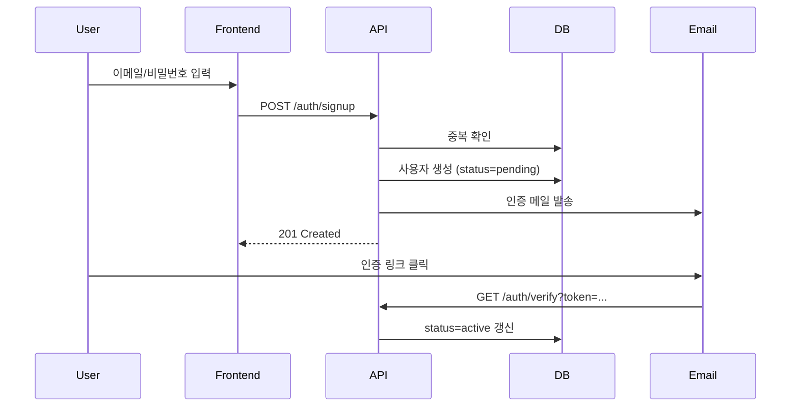

# F-001: 사용자 인증 (User Authentication)

> 이메일/비밀번호 기반 회원가입·로그인·비밀번호 재설정 기능.
> 모든 보호된 리소스 접근의 전제 조건.

## 1. 배경 (Why)

### 문제
- 사용자별로 데이터를 격리해야 함
- 권한 기반 기능 접근 제어 필요

### 비즈니스 가치
- 사용자 식별 → 개인화 경험 제공
- 보안 컴플라이언스 요건 충족

## 2. 사용자 스토리

- **회원가입**: 잠재 사용자로서, 이메일과 비밀번호로 계정을 만들고 싶다. 빠르게 서비스를 시작하기 위해.
- **로그인**: 기존 사용자로서, 내 계정으로 로그인하고 싶다. 내 데이터에 접근하기 위해.
- **비밀번호 재설정**: 비밀번호를 잊은 사용자로서, 이메일로 재설정하고 싶다. 계정 복구를 위해.

## 3. 핵심 동작

### 회원가입 흐름

### 로그인 흐름
1. 사용자가 이메일/비밀번호 입력
2. API가 자격 증명 검증
3. JWT Access Token (1h) + Refresh Token (30d) 발급
4. Refresh Token은 httpOnly 쿠키로 저장

## 4. 인수 조건 (Acceptance Criteria)

### 회원가입
- [ ] 유효한 이메일 형식 검증 (RFC 5322)
- [ ] 비밀번호 최소 요건: 8자 이상, 영문+숫자+특수문자
- [ ] 중복 이메일은 409 Conflict 반환
- [ ] 인증 메일은 가입 후 5초 이내 발송
- [ ] 인증 링크는 24시간 후 만료

### 로그인
- [ ] 5회 연속 실패 시 15분간 계정 잠금
- [ ] Access Token 만료 시 Refresh Token으로 자동 갱신
- [ ] 로그아웃 시 Refresh Token 즉시 무효화

### 비밀번호 재설정
- [ ] 재설정 링크는 1시간 후 만료
- [ ] 재설정 완료 시 모든 기존 세션 무효화

## 5. Out of Scope (이 기능에서 안 함)
- ❌ 소셜 로그인 (OAuth) → F-015에서 별도 진행
- ❌ 2FA → F-020에서 별도 진행
- ❌ SSO/SAML → 엔터프라이즈 단계에서

## 6. 엣지 케이스

| 시나리오 | 처리 방법 |
|---|---|
| 동일 사용자 동시 로그인 | 허용 (각 세션 독립) |
| 인증 메일 미수신 | 재발송 가능 (3회/시간 제한) |
| 탈퇴 후 동일 이메일 재가입 | 30일 cooling period 후 가능 |
| 비밀번호 재설정 중 다른 기기에서 로그인 | 재설정 완료 시 모든 세션 종료 |

## 7. 성공 지표
- 회원가입 완료율 (가입 시작 → 이메일 인증) > 70%
- 로그인 성공률 > 99%
- 인증 API p95 응답시간 < 200ms

## 8. 관련 문서
- 도메인 로직: [`../../02-domains/identity/`](../../02-domains/identity/)
- API 스펙: [`../../04-api/rest/auth.yaml`](../../04-api/rest/auth.yaml)
- 데이터 모델: [`../../05-data/schemas/users.md`](../../05-data/schemas/users.md)
- 결정 기록: [ADR-003 인증 방식 선택](../../07-decisions/ADR-003-auth-strategy.md)

## 9. 변경 이력
- 2026-01-15: 초안 작성
- 2026-02-01: 비밀번호 정책 강화 (PM 리뷰 반영)
- 2026-04-01: status → approved
