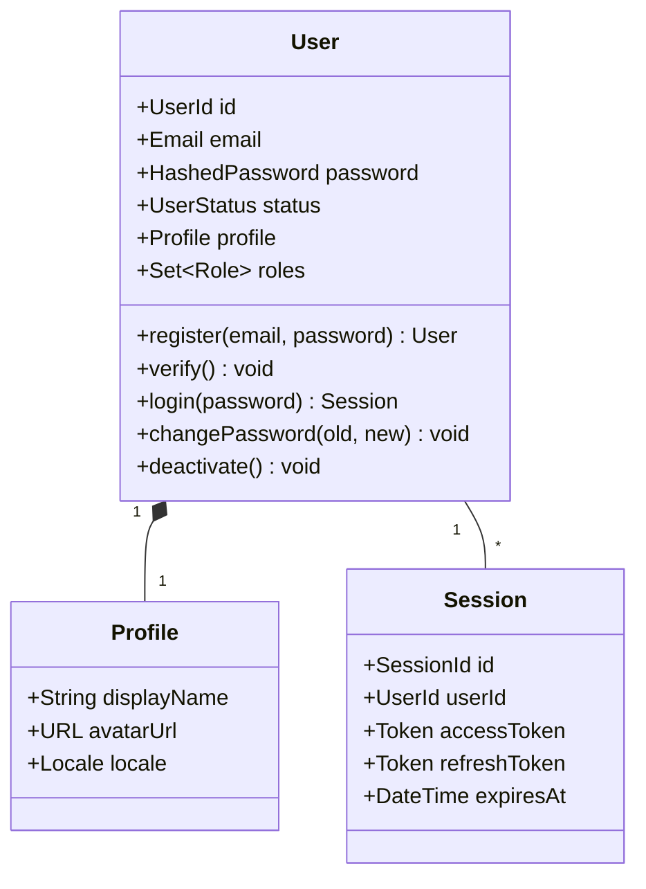
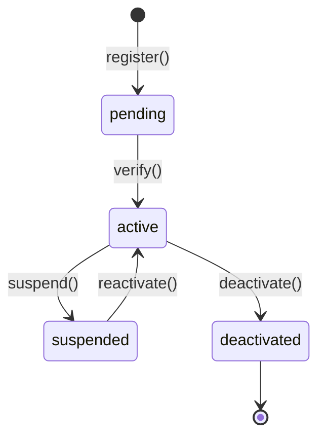

# Identity Domain Model

> 엔티티, 값 객체, 애그리게이트의 정의.
> DB 스키마는 `05-data/`에 있음. 여기는 **개념적 모델**만.

## 애그리게이트

### User Aggregate

## 값 객체 (Value Objects)

### Email
- 검증: RFC 5322
- 정규화: 소문자 변환
- 불변

### HashedPassword
- 알고리즘: Argon2id
- 평문 비밀번호는 절대 저장·로깅 금지

### UserStatus
열거형: `pending`, `active`, `suspended`, `deactivated`

상태 전이:

## 불변 조건 (Invariants)
1. User는 항상 정확히 하나의 활성 Email을 가진다
2. 같은 Email로 가입된 User는 둘 이상 존재할 수 없다 (deactivated 제외)
3. `pending` 상태에서는 로그인 불가
4. `deactivated` 상태에서는 모든 도메인 작업 불가
