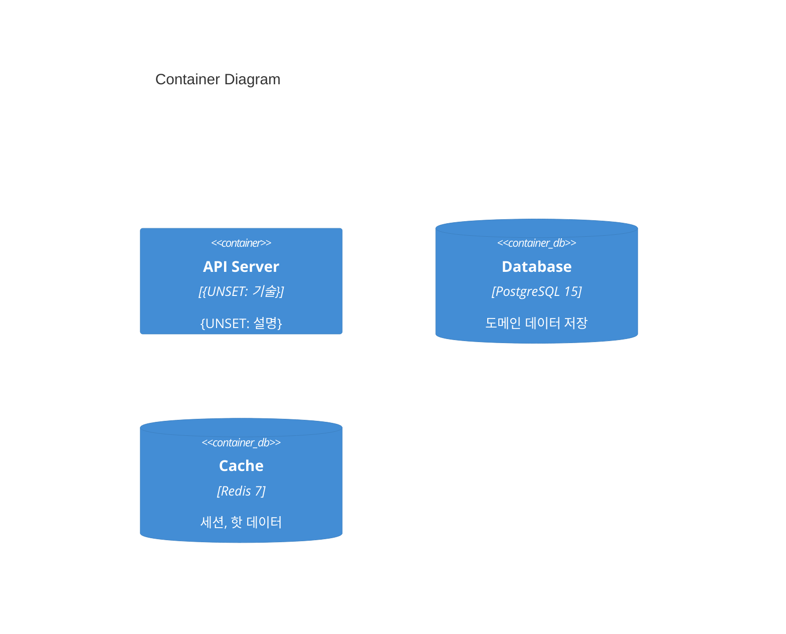

# Containers (C4 Level 2)

> 배포 가능한 단위(앱, DB, 큐, 캐시 등)의 구성.
> 각 컨테이너의 기술 선택과 역할.

## 컨테이너 다이어그램

{UNSET: Mermaid C4 Container 다이어그램}

## 컨테이너 목록

| 컨테이너 | 기술 | 역할 | 포트 |
|---|---|---|---|
| API Server | {UNSET} | {UNSET} | {UNSET} |
| Database | PostgreSQL 15 | OLTP, 도메인 데이터 | 5432 |
| Cache | Redis 7 | 세션, 핫 데이터 | 6379 |
| Queue | {UNSET} | 비동기 작업 | {UNSET} |

## 관련 문서
- **외부 맥락**: [System Context](./system-context.md) (C4 Level 1)
- **내부 구조**: [Components](./components.md) (C4 Level 3)
- **기술 선택**: [Tech Stack](./tech-stack.md)
