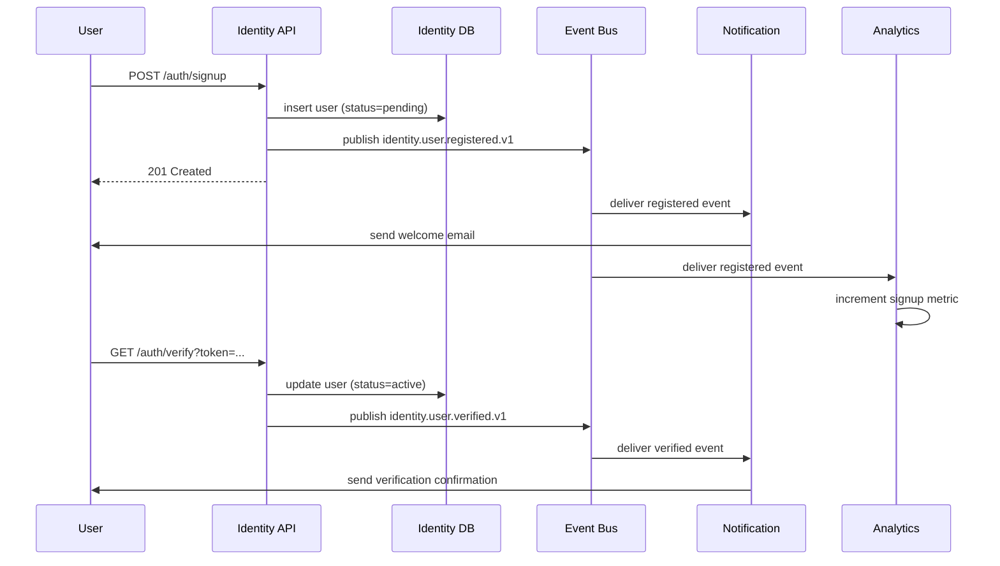
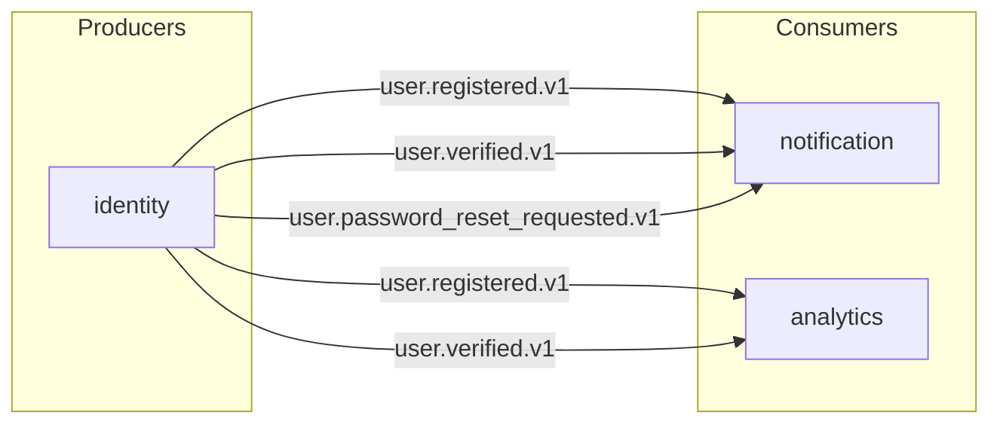

# Event Map (도메인 간 이벤트 흐름)

> 모든 도메인이 발행/구독하는 이벤트의 중앙 매트릭스.
> 새 도메인 이벤트 추가/제거 시 반드시 이 문서를 갱신하세요.
> 마지막 갱신: 2026-04-25

## 역할

이 문서는 **도메인 간 비동기 통신의 SSOT**입니다:
- 어떤 도메인이 무엇을 발행하는가
- 누가 그 이벤트를 구독하는가
- 이벤트 형식 정의는 어디 있는가
- 이벤트 사이의 의존성·순서·중복 가능성

→ 코드 변경, 도메인 분리/통합, 장애 분석 시 첫 번째로 보는 문서.

---

## 이벤트 명명 규칙

```
{도메인}.{집합체}.{과거형 동사}.v{버전}
```

예시:
- `identity.user.registered.v1`
- `order.order.placed.v1`
- `payment.payment.failed.v2`

원칙:
- **과거형**: 이벤트는 **이미 일어난 사실** (`registering` ❌, `registered` ✅)
- **버전 명시**: 호환성 깨지면 `.v2` 신설, `.v1` 일정 기간 동시 발행
- **소문자 + 점**: 메시지 브로커 라우팅 패턴과 호환

---

## 이벤트 발행/구독 매트릭스

> 각 행: 발행 이벤트. 각 열: 구독 도메인. 셀: 구독 이유 또는 부작용.

<!-- 새 이벤트 추가 시 행 추가, 새 도메인 추가 시 열 추가 -->

| 발행 이벤트 | 발행 도메인 | identity | notification | analytics | _(향후 추가)_ |
|---|---|---|---|---|---|
| `identity.user.registered.v1` | identity | — | 환영 메일 발송 | 가입 메트릭 수집 | |
| `identity.user.verified.v1` | identity | — | 인증 완료 알림 | 활성 사용자 카운트 | |
| `identity.user.password_reset_requested.v1` | identity | — | 재설정 메일 발송 | — | |

> 💡 빈 셀(`—`)은 명시적으로 "구독 안 함"을 의미합니다. **구독 안 한다고 비워두지 말 것** — 빈 셀은 "검토 안 됨"으로 오해될 수 있음.

---

## 이벤트 상세

### `identity.user.registered.v1`

- **발행 시점**: 회원가입 완료 직후 (`POST /auth/signup` 응답 후)
- **트랜잭션 경계**: identity 도메인의 User Aggregate 저장과 같은 트랜잭션
- **스키마**: `docs/04-api/events/identity-events.yaml`
- **payload 핵심**: `user_id`, `email`, `registered_at`
- **idempotency**: 같은 `event_id`는 여러 번 도착할 수 있음 (구독자가 멱등 처리)
- **순서 보장**: identity 발행 순서대로 (큐 파티션 키 = `user_id`)
- **재처리 정책**: 24시간 이내 무제한 재시도, 이후 DLQ
- **DEPRECATED 시점**: TBD (현재 active)

### `identity.user.verified.v1`

- **발행 시점**: 이메일 인증 링크 클릭 후 `status=active` 변경 시
- **선행 조건**: `identity.user.registered.v1`이 먼저 발행되어 있어야 함
- **payload 핵심**: `user_id`, `verified_at`
- **순서 보장**: registered → verified 순서. 구독자는 registered가 도착하지 않았다면 잠시 보류 가능

### `identity.user.password_reset_requested.v1`

- **발행 시점**: 비밀번호 재설정 요청 시
- **payload 핵심**: `user_id`, `reset_token` (단방향 해시), `expires_at`
- **보안 주의**: payload에 평문 토큰 절대 금지

---

## 이벤트 흐름 다이어그램

### 회원가입 → 인증 → 환영 메일



---

## 의존성 그래프

도메인 간 이벤트 의존성을 한눈에 확인:



---

## 이벤트 추가 절차

새 이벤트를 도입할 때:

1. **이름 결정**: `{domain}.{aggregate}.{verb_past}.v1` 규칙 준수
2. **스키마 정의**: `docs/04-api/events/{domain}-events.yaml`에 AsyncAPI로 추가
3. **이 문서 갱신**:
   - 매트릭스에 행 추가, 모든 열 명시적으로 채움 (`—` 또는 구독 이유)
   - "이벤트 상세" 섹션에 새 이벤트 항목 추가
   - 의존성 그래프 갱신
4. **구독자 사전 합의**: 기대되는 구독 도메인 팀과 사전 협의
5. **PR 리뷰**: Architect / Tech Lead 리뷰 필수
6. **breaking change**: `.v2` 신설 + `.v1` 일정 기간 동시 발행 + RFC 작성

---

## 이벤트 폐기 절차

이벤트를 더 이상 발행하지 않으려면:

1. RFC 작성 (`/new-rfc "Deprecate identity.user.registered.v1"`)
2. 구독자 모두 다른 이벤트로 마이그레이션 또는 중단 합의
3. 일정 기간 (최소 1개 분기) 발행 유지하면서 `deprecated` 표시
4. 대상 일자 도래 시 발행 중단
5. 이 문서에서 행 삭제, "Deprecated 이벤트" 아카이브 섹션에 이력 보존

### Deprecated 이벤트 아카이브

| 이벤트 | 폐기일 | 대체 | RFC |
|---|---|---|---|
| _(현재 폐기된 이벤트 없음)_ | — | — | — |

---

## 관련 문서
- [도메인 우선 워크플로](../09-guides/domain-first-workflow.md)
- [API 폴더 가이드](../04-api/CLAUDE.md)
- [이벤트 스키마 (AsyncAPI)](../04-api/events/)
- [Data Flow 다이어그램](./data-flow.md)
- [도메인 인덱스](../02-domains/INDEX.md)
