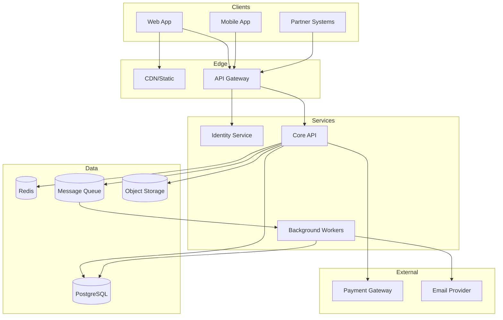

# 시스템 아키텍처 개요

> 시스템 전체를 한 눈에 보는 진입 문서.
> 새 팀원이 가장 먼저 읽어야 할 문서.
> 마지막 갱신: YYYY-MM-DD

## 한 장 요약



## 아키텍처 스타일

### 현재: Modular Monolith
- 단일 코드베이스, 도메인별 모듈 분리
- 단일 데이터베이스, 도메인별 스키마 분리
- 향후 마이크로서비스 분리 가능하도록 모듈 경계 엄격히 유지

### 왜 모놀리식인가?
[ADR-001 참조](../07-decisions/ADR-001-monolith-first.md)
- 팀 규모 (3명)에서 마이크로서비스는 오버헤드
- 도메인 경계가 아직 안정화되지 않음
- 트랜잭션 일관성 확보 용이

### 마이크로서비스 분리 트리거
다음 조건 중 하나 이상 충족 시 분리 검토:
- 팀 규모 15명 초과
- 특정 도메인의 배포 빈도가 다른 도메인의 10배 이상
- 도메인별 확장 요구사항이 크게 다름 (예: 결제만 100배 트래픽)

## 핵심 원칙

1. **도메인 경계 우선**: 코드 모듈은 도메인 경계를 따른다
2. **비동기 기본**: 도메인 간 통신은 가능하면 이벤트로
3. **무상태 서비스**: 모든 상태는 DB/캐시에. 서비스 인스턴스는 언제든 죽일 수 있어야 함
4. **API 우선 설계**: 구현 전에 API 계약부터 (`04-api/`)
5. **관찰 가능성**: 모든 요청은 추적 가능 (TraceID, 구조화된 로그)

## 핵심 데이터 흐름

### 동기 요청 (예: 사용자 로그인)
```
Client → API Gateway → Identity Service → DB → Identity Service → API Gateway → Client
                                       ↓
                                    Cache (세션)
```

### 비동기 흐름 (예: 회원가입 후 환영 메일)
```
Client → API Gateway → Identity Service → DB
                                       ↓
                                  Event: UserRegistered
                                       ↓
                                    Queue
                                       ↓
                              Notification Worker → Email Provider
```

## 비기능 요구사항 (NFR)

| 항목 | 목표 | 측정 |
|---|---|---|
| 가용성 | 99.9% | uptime monitoring |
| API 응답 시간 (p95) | < 300ms | APM |
| 동시 사용자 | 10,000 | 부하 테스트 |
| 데이터 내구성 | RPO 1시간 | 백업 정책 |
| 복구 시간 | RTO 4시간 | DR 훈련 |

## 관련 문서
- [기술 스택](./tech-stack.md)
- [컨테이너 다이어그램](./containers.md)
- [데이터 흐름 상세](./data-flow.md)
- [보안 모델](./security.md)
- [인프라](./infrastructure.md)
