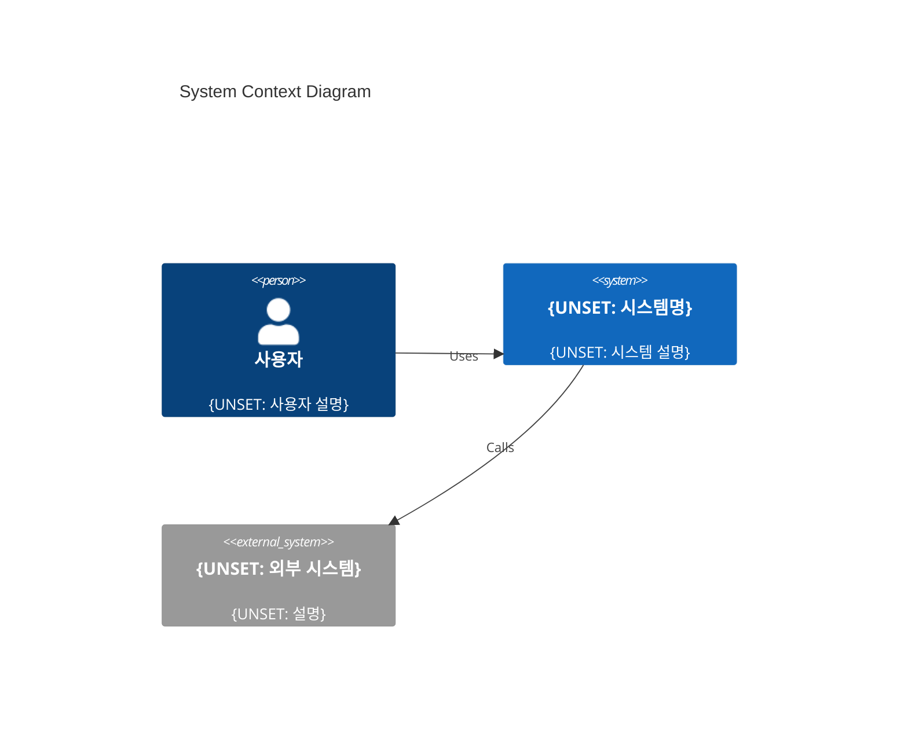

# System Context (C4 Level 1)

> 우리 시스템과 외부 세계의 관계. 사용자, 외부 시스템과의 상호작용 범위.
> 작성 가이드: C4 Context Diagram + 설명.

## 시스템 컨텍스트 다이어그램

{UNSET: Mermaid C4 Context 다이어그램}

## 외부 시스템 목록

| 시스템 | 역할 | 통신 방식 | 의존도 |
|---|---|---|---|
| {UNSET} | {UNSET} | {UNSET} | {UNSET} |

## 관련 문서
- **상세 구조**: [Containers](./containers.md) (C4 Level 2)
- **아키텍처 개요**: [Overview](./overview.md)
