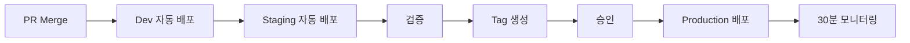

# 배포 (Deployment)

> 배포 절차와 정책.

## 환경

| 환경 | URL | 브랜치 | 자동 배포 |
|---|---|---|---|
| Local | localhost | - | - |
| Dev | dev.example.com | `develop` | ✅ on push |
| Staging | staging.example.com | `main` | ✅ on merge |
| Production | example.com | `main` (tag) | ⚠️ 수동 승인 |

## 배포 흐름

## 배포 전 체크리스트
- [ ] CI 모두 통과
- [ ] 코드 리뷰 승인
- [ ] DB 마이그레이션 검토 (있을 시)
- [ ] Feature Flag 설정 (필요 시)
- [ ] 롤백 계획 확인
- [ ] 관련 팀 사전 공지 (Breaking Change)

## 프로덕션 배포 전략

### Canary 배포
1. 5% 트래픽 → 10분 모니터링
2. 50% 트래픽 → 10분 모니터링
3. 100% 전환

### Blue-Green
- 신규 버전을 별도 환경에 배포
- 검증 후 트래픽 전환 (즉시 롤백 가능)

### Feature Flag
- 큰 변경은 Flag로 감싸 배포
- Flag로 점진적 활성화
- 문제 발생 시 Flag만 끄면 즉시 비활성화

## 롤백 정책
- 배포 후 30분 내 SLO 위반 → 자동 롤백 검토
- 데이터 마이그레이션이 있는 배포는 Forward-fix 우선
- 롤백 결정은 온콜 + Tech Lead

## 배포 시간 정책
- ✅ 평일 오전~오후 (10:00~16:00)
- ⚠️ 금요일 오후 배포 금지 (긴급 제외)
- ❌ 주말, 공휴일, 심야 배포 금지

## 긴급 배포 (Hotfix)
- 별도 브랜치: `hotfix/issue-XXX`
- 단축 절차: 1명 리뷰 + 즉시 배포
- 사후 포스트모템 필수

## 관련 문서
- [환경 설정](./environments.md)
- [모니터링](./monitoring.md)
- [장애 대응](./incident-response.md)
