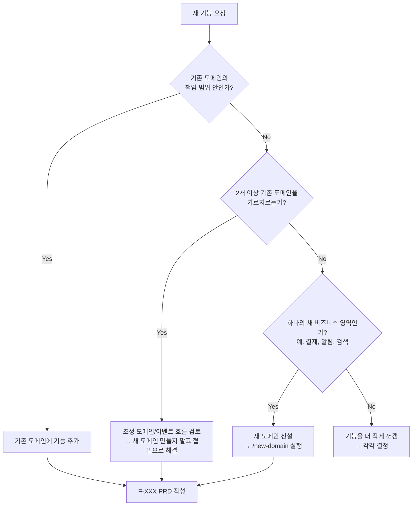

# 도메인 우선 워크플로 가이드

> 새 기능을 받았을 때 "기존 도메인에 추가할까, 새 도메인을 만들까"를 결정하는 가이드.
> 모든 신규 기능 PRD 작성 전에 먼저 이 가이드를 따라 도메인 결정을 마치세요.
> 마지막 갱신: 2026-04-25

## 왜 중요한가

도메인 경계를 잘못 그으면 **나중에 분리하는 비용이 10배 이상 큽니다**:
- 같은 트랜잭션 안에 5개 도메인 호출 → 분산 트랜잭션 지옥
- 같은 용어가 도메인마다 다른 의미 → 팀 간 의사소통 비용
- 한 팀이 5개 도메인 코드를 동시에 수정 → 변경 영향도 폭발

기능을 만들기 전에 30분 투자해서 결정하면 6개월의 리팩터링을 막습니다.

---

## 의사결정 플로우



---

## 기존 도메인에 추가하는 신호

다음이 **모두** 해당하면 새 도메인을 만들지 말고 기존 도메인에 추가:

- ✅ 그 도메인의 **기존 엔티티**(User, Order, Product 등)에 필드/동작을 더하는 정도
- ✅ 그 도메인의 **유비쿼터스 언어**(Ubiquitous Language)와 일치하는 용어 사용
- ✅ 그 도메인 **단일 트랜잭션** 안에서 처리 가능
- ✅ 그 도메인 팀이 **단독으로 결정**할 수 있는 변경 범위

### 예시
| 기능 | 기존 도메인 | 이유 |
|---|---|---|
| "이메일 변경" | `identity` | User 엔티티의 속성 변경 |
| "비밀번호 재설정" | `identity` | 인증 흐름의 연장 |
| "주문 취소" | `order` | Order의 상태 전이 |
| "장바구니에 상품 담기" | `catalog` 또는 `order` | 도메인 정의에 따라 |

---

## 새 도메인이 필요한 신호

다음 중 **3개 이상** 해당하면 새 도메인을 신설:

- 🆕 새 비즈니스 개념 (예: "구독", "정산", "알림", "리워드")
- 🆕 별도의 데이터 저장소가 필요 (다른 DB, 다른 스키마 그룹)
- 🆕 다른 팀/외부 벤더가 책임짐
- 🆕 독립된 라이프사이클 (다른 배포 주기, 다른 SLA)
- 🆕 기존 도메인에 넣으면 **3개 이상의 기존 엔티티가 갑자기 비대**해짐
- 🆕 기존 도메인의 비즈니스 규칙과 **충돌**하거나 **다른 컨텍스트** 사용

### 예시
| 기능 | 새 도메인 | 이유 |
|---|---|---|
| "구독 결제 자동 재시도" | `billing` | 결제 + 스케줄링이 별도 책임 |
| "푸시 알림 발송" | `notification` | 모든 도메인이 publish 하는 cross-cutting |
| "고객 등급 산정" | `loyalty` | 별도 로직 + 별도 스토어 |
| "관리자 감사 로그" | `audit` | 모든 도메인의 변경을 수집, 별도 보존 정책 |

---

## 절대 새 도메인을 만들면 안 되는 경우

- ❌ 한 기능 때문에 (도메인은 **여러 기능의 묶음**)
- ❌ 한 화면 때문에 (UI는 도메인이 아님)
- ❌ 한 API 엔드포인트 때문에 (API는 도메인의 표면)
- ❌ "혹시 나중에 분리할 수도 있어서" (YAGNI — 필요해지면 그때 분리)

---

## 도메인 간 협력이 필요할 때

여러 도메인을 가로지르는 기능은 **새 도메인을 만들지 말고** 다음 중 하나로 해결:

### 1. 동기 호출 (강한 일관성 필요)
```
Order ──REST/gRPC──> Identity (사용자 자격 확인)
```
- 지연 민감, 트랜잭션 경계 안에서 처리
- 정당화 필요 (대부분의 경우 비동기가 낫다)

### 2. 비동기 이벤트 (느슨한 결합, 기본값)
```
Identity ──user.registered──> Notification (환영 메일)
                          ──> Analytics (가입 추적)
```
- 발행 도메인이 구독자를 모름
- [event-map.md](../03-architecture/event-map.md)에 모든 이벤트 흐름 등록

### 3. Saga 패턴 (긴 트랜잭션)
- 여러 도메인 결제 → 재고 차감 → 배송 같은 흐름
- 각 단계가 독립적으로 보상(compensation) 가능해야 함

→ 자세한 패턴은 아키텍처 ADR(`docs/07-decisions/`)에서 확인하세요. (Modular Monolith / Microservices / Saga 등)

---

## 새 도메인 생성 절차

새 도메인이 필요하다고 판단되면:

```bash
# 1. 도메인 폴더 스캐폴딩
/new-domain payment

# 2. 자동 생성된 도메인 문서 작성
docs/02-domains/payment/
├── CLAUDE.md           # 도메인 진입점
├── domain-model.md     # 엔티티/값 객체
├── business-rules.md   # 비즈니스 규칙
└── edge-cases.md       # 예외 처리

# 3. 도메인 결정에 ADR 작성 (해당 시)
/new-adr "Introduce payment domain"

# 4. 인덱스 갱신 (자동)
bash .claude/scripts/gen-indexes.sh
bash .claude/scripts/sync-registry.sh
```

---

## 자가 점검 체크리스트

도메인 결정을 PRD에 적기 전에:

- [ ] 기능을 한 문장으로 설명했을 때, 어떤 도메인의 용어로 말하는가?
- [ ] 이 기능이 다른 팀의 책임에 침범하지 않는가?
- [ ] 이 기능이 실패하면 영향받는 도메인은 몇 개인가? (1개 = OK, 3개 이상 = 위험)
- [ ] 비즈니스 규칙이 기존 도메인의 규칙과 모순되지 않는가?
- [ ] 이 도메인의 ADR이 이 기능을 허용하는가?

---

## 관련 문서
- [도메인 폴더 가이드](../02-domains/CLAUDE.md)
- [도메인 인덱스](../02-domains/INDEX.md)
- [이벤트 매핑](../03-architecture/event-map.md)
- [feature 작성 가이드](../01-product/CLAUDE.md)
- [ADR 작성 가이드](../07-decisions/CLAUDE.md)
