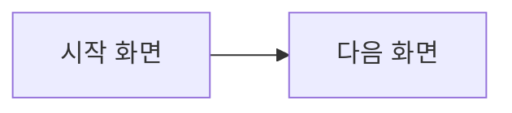

# [기능명] 프론트엔드 설계

> 기획 문서: [1-feat/&lt;기능명&gt;.md](../1-feat/<기능명>.md)  ← 복사 후 `<기능명>`을 실제 슬러그로 치환

## 1. 화면 / 페이지
| 화면 | 경로 | 설명 |
|---|---|---|
| {UNSET} | {UNSET} | {UNSET} |

## 2. 화면 흐름

## 3. 컴포넌트 구조
- {UNSET: 주요 컴포넌트와 책임}

## 4. 상태 관리
- **로컬 상태**: {UNSET}
- **전역/서버 상태**: {UNSET}

## 5. 라우팅
- {UNSET: 경로 ↔ 화면 매핑, 가드/권한}

## 6. API 연동 (→ 백엔드 요구사항)
> 백엔드 설계 문서에 그대로 전달되는 계약.

| 동작 | 메서드/경로 | 요청 | 응답 |
|---|---|---|---|
| {UNSET} | {UNSET} | {UNSET} | {UNSET} |

## 7. 상태별 UI (로딩 / 빈 상태 / 에러)
- {UNSET}

## 다음 단계
- 백엔드 설계: [3-api/&lt;기능명&gt;.md](../3-api/<기능명>.md)
