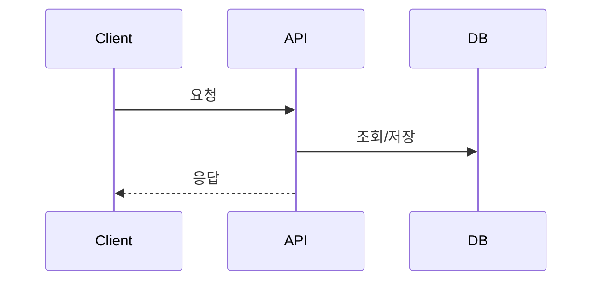

# [기능명] 백엔드 설계

> 기획: [1-feat/&lt;기능명&gt;.md](../1-feat/<기능명>.md)  ← 복사 후 `<기능명>`을 실제 슬러그로 치환
> 프론트 API 요구: [2-web/&lt;기능명&gt;.md](../2-web/<기능명>.md)  (UI 없는 기능이면 생략)

## 1. 데이터 모델
```
{UNSET: 엔티티 / 테이블 / 필드 / 관계}
```

## 2. API 엔드포인트
> 프론트엔드 설계의 "API 연동" 표를 구현 관점에서 확정.

### `[METHOD] /path`
- **요청**: {UNSET}
- **응답**: {UNSET}
- **검증 규칙**: {UNSET}
- **권한**: {UNSET}

## 3. 비즈니스 로직 / 흐름


## 4. 외부 의존성
- {UNSET: 외부 API, 큐, 캐시, 스토리지 등}

## 5. 에러 처리 & 검증
| 상황 | 응답/코드 | 처리 |
|---|---|---|
| {UNSET} | {UNSET} | {UNSET} |

## 6. 보안 / 권한
- {UNSET: 인증, 인가, 입력 검증, 레이트 리밋}
